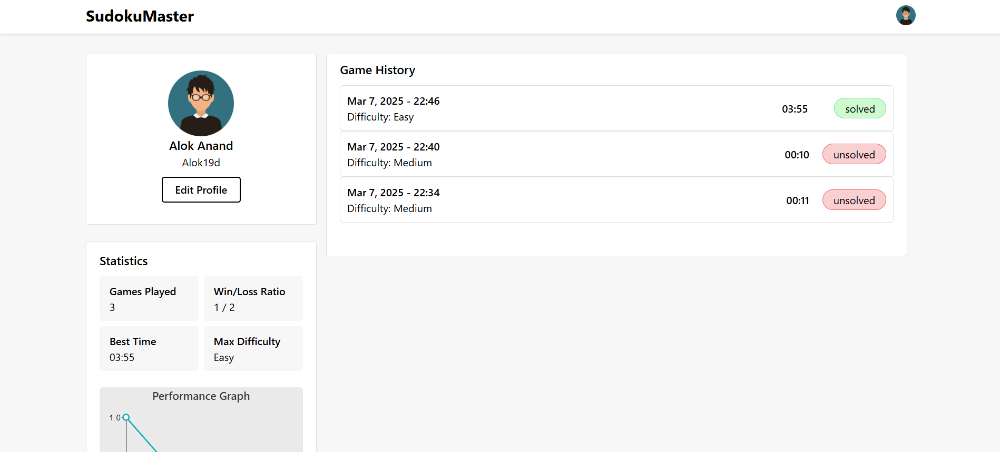

# Sudoku Master

A sophisticated Sudoku application built with modern web technologies that combines an elegant user interface with powerful solving algorithms. Features multiple difficulty levels, real-time validation, and an advanced implementation of Donald Knuth's Dancing Links algorithm.

[Live Demo]()

## Key Features

- **Multiple Difficulty Levels**
  - Easy (45 initial clues)
  - Medium (35 initial clues) 
  - Hard (30 initial clues)
  - Expert (24 initial clues)

- **Smart Game Features**
  - Real-time move validation
  - Intelligent hint system
  - Timer with pause/resume
  - Cell highlighting and error detection
  - Undo/Reset functionality

- **Custom Mode**
  - Create your own puzzles
  - Automatic solution validation
  - Minimum 16 clues required
  - Board locking mechanism

## Technical Implementation

### Core Algorithm
The application uses the Dancing Links (DLX) algorithm, implementing Sudoku as an exact cover problem:
- Converts Sudoku constraints into a binary matrix
- Uses doubly-linked lists for efficient backtracking
- Guarantees optimal solution finding
- Ensures puzzle uniqueness during generation

### State Management
Implements Redux for centralized state control:
- Board state management
- Game progress tracking
- User preferences & statistics
- Persistent storage using localStorage

### User Interface
Built with React 18 and modern CSS:
- Responsive grid layout
- Dynamic cell highlighting
- Touch-friendly mobile interface
- Smooth animations and transitions

## Technology Stack

- **Frontend Framework:** React 18
- **State Management:** Redux Toolkit
- **Build Tool:** Vite
- **UI Components:** Custom CSS3
- **Icons:** FontAwesome
- **Charts:** MUI X-Charts
- **Development:**
  - ESLint
  - Tailwind CSS
  - React Router DOM

## Project Structure
```
sudoku-master/
├── src/
│   ├── components/        # Reusable UI components
│   ├── pages/            # Route components
│   ├── redux/
│   │   └── features/     # Redux slices & reducers
│   ├── utils/
│   │   └── sudoku-features.js  # Core algorithms
│   └── App.jsx          # Root component
└── public/              # Static assets
```

## Dependencies
```json
 "dependencies": {
    "@emotion/react": "^11.14.0",
    "@emotion/styled": "^11.14.0",
    "@fortawesome/fontawesome-svg-core": "^6.7.2",
    "@fortawesome/free-brands-svg-icons": "^6.7.2",
    "@fortawesome/free-regular-svg-icons": "^6.7.2",
    "@fortawesome/free-solid-svg-icons": "^6.7.2",
    "@fortawesome/react-fontawesome": "^0.2.2",
    "@mui/material": "^6.4.7",
    "@mui/styled-engine-sc": "^6.4.6",
    "@mui/x-charts": "^7.27.1",
    "@reduxjs/toolkit": "^2.5.1",
    "@tailwindcss/vite": "^4.0.7",
    "crypto": "^1.0.1",
    "react": "^19.0.0",
    "react-dom": "^19.0.0",
    "react-redux": "^9.2.0",
    "react-router-dom": "^7.2.0",
    "styled-components": "^6.1.15",
    "tailwindcss": "^4.0.7"
}
```

## Overview of Sudoku Master

### Dashboard View


### Profile View


### About View


### Mobile Responsive View
<div style="display:grid; grid-template-columns:repeat(3,1fr);">
   
   
   
   
</div>

## Installation and Setup

1. **Clone the repository**
   ```bash
   git clone https://github.com/Alok19d/Sudoku-Master
   ```

2. **Navigate to the project directory**
   ```bash
   cd zerodha-frontend-clone
   ```

3. **Install dependencies**
   ```bash
   npm install
   ```

4. **Start the development server**
   ```bash
   npm run dev
   ```

5. **Access the application**
   Open [http://localhost:5173](http://localhost:5173) in your browser to view the project.


## How to Contribute

1. Fork the repository.
2. Create a new branch for your feature or bugfix.
   ```bash
   git checkout -b feature/your-feature-name
   ```
3. Commit your changes.
   ```bash
   git commit -m "Add your feature description here"
   ```
4. Push the branch to your forked repository.
   ```bash
   git push origin feature/your-feature-name
   ```
5. Open a pull request in the original repository.

## Contact
For queries or feedback, please contact [Alok](mailto:anandkumar19d@gmail.com).

---